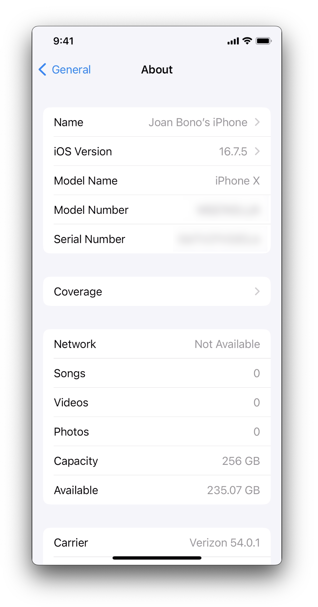
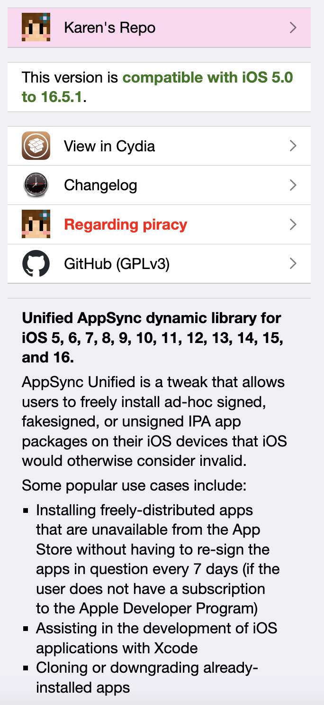
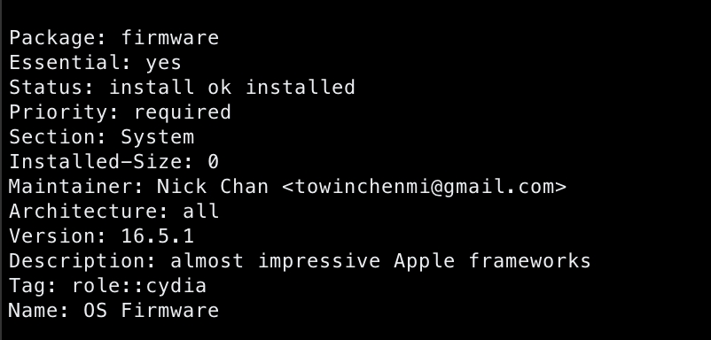
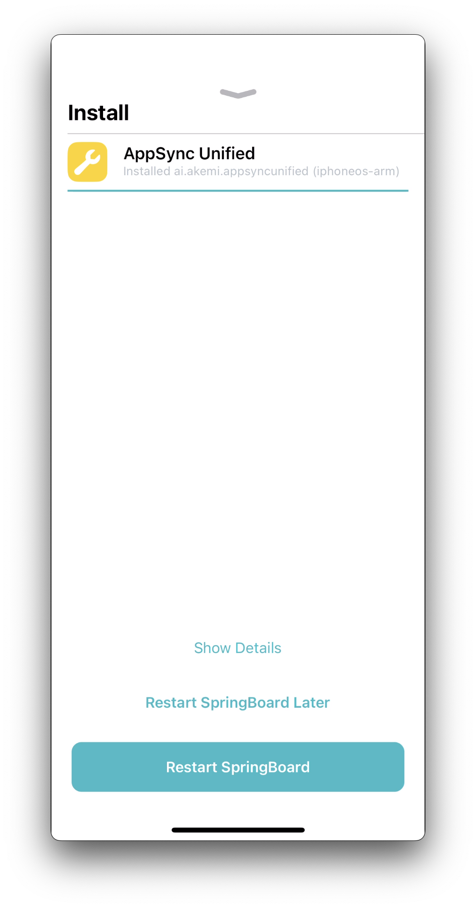

# AppSync Unified on unsupported devices

iPhone X with the latest iOS version available as of today (16.7.5) is not supported by AppSync Unified. How to fix it.

## Prerequisites 

+ Jailbreak the iPhone using [`palera1n`](https://palera.in/)
+ Install [`Sileo`](https://getsileo.app/) or [`Zebra`](https://getzbra.com/)
+ Add Kare's Repo (`https://cydia.akemi.ai`) as a resource

## Install AppSync Unified

The device being used is an iPhone X with 256 GB of space.



When attempting to install AppSync Unified, we got the following error on Sileo


After reviewing the information about AppSync unified, it supports iOS versions from 5.0 up to 16.5.1:



Thus, let's modify the firmware version. For that, I'm using `vim` installed through Sileo as well, however, it can be done with Filza using the text editor.

Edit the file `/var/lib/dpkg/status`. Look for the following:


```yaml
Package: firmware # Important, package has to be the firmware one
Essential: yes
Status: install ok installed
Priority: required
Section: System
Installed-Size: 0
Maintainer: Nick Chan <towinchenmi@gmail.com>
Architecture: all
Version: 16.7.5 # This is my current firmware version
Description: almost impressive Apple frameworks
Tag: role::cydia
Name: OS Firmware
```

Modify the version to `16.5.1`, which is the latest supported:



Go back to Sileo, and install AppSync Unified. 



Done! 