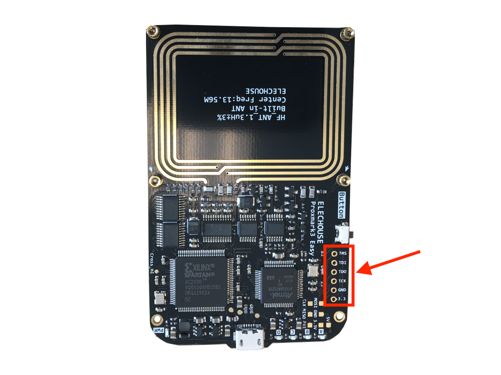
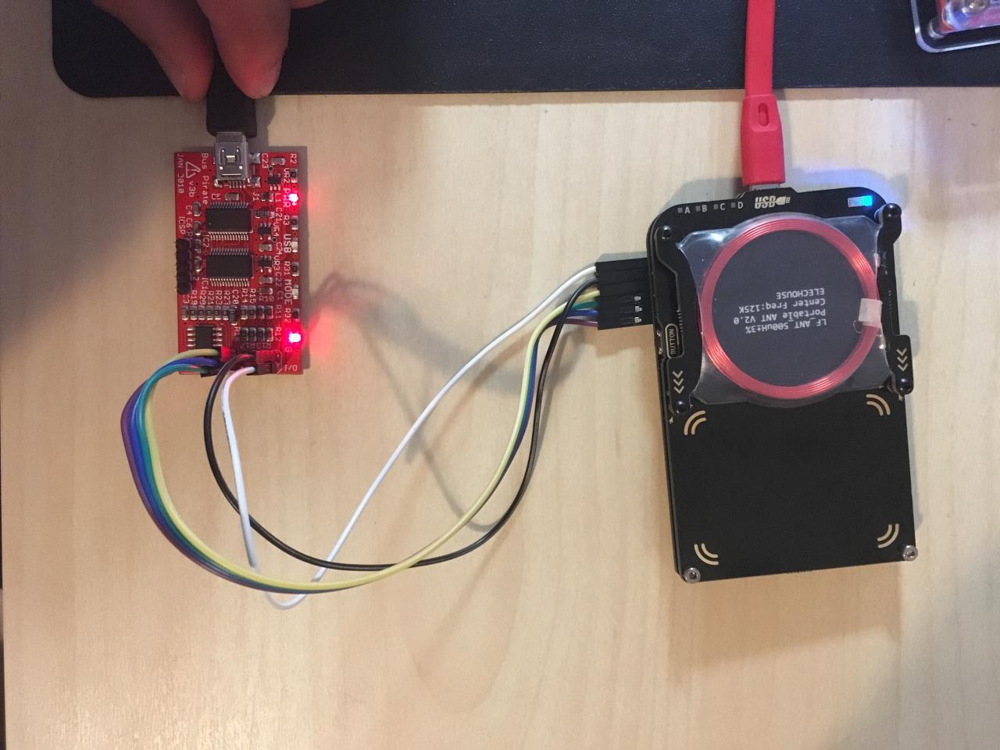

# Reflashing Proxmark3 RV3.0 using a Bus Pirate

Experimenting with my **Proxmark3 RV3.0**, I broke the bootloader.

Taking advantage of that I have two [**Bus Pirate**](http://dangerousprototypes.com/docs/Bus_Pirate), I used it to reflash the device.

First of all, the connection.

The **Proxmark3** has `JTAG` pinout, so, let use them!

The connections with the **Bus Pirate**:

| Proxmark3 | Bus Pirate | Cable Color |
|:---------:|:----------:|:-----------:|
| `TMS`     |   `CS`     |  Purple     |
| `TDI`     |   `MISO`   |  Blue       |
| `TDO`     |   `MOSI`   |  Green      |
| `TCK`     |   `CLK`    |  Yellow     |
| `GND`     |   `GND`    |  Black      |
| `3.3`     |   `+3.3`   |  White      |

As seen in the picture:

So, the steps are the following:

1. Clone the `proxmark3` repository.
2. Install `openocd`.
3. Compile the code.
4. Connect the **Bus Pirate** and the **Proxmark3** using probe cables.
5. Use `openocd` to flash the firmware.

For this, we need two command prompts. In the first one:

~~~bash
jbono@MacBook [~]> git clone https://github.com/proxmark/proxmark3
jbono@MacBook [~]> cd proxmark3
jbono@MacBook [~/proxmark3]> brew install openocd
jbono@MacBook [~/proxmark3]> make clean; make
~~~

Now we have to point the `openocd` configuration file to our **Bus Pirate**. Connect to the computer using USB cable and then:

~~~bash
jbono@MacBook [~/proxmark3]> ls /dev/tty.*
/dev/tty.usbserial-A900fzzr
~~~

So, modify the `openocd` configuration file:

~~~bash 
jbono@MacBook [~/proxmark3]> head tools/at91sam7s512-buspirate.cfg
# Ports
telnet_port 4444
gdb_port 3333

# Interface
interface buspirate
buspirate_port /dev/tty.usbserial-A900fzzr
adapter_khz 1000

# Communication speed
~~~

Now it's time to start `openocd`:

~~~bash
jbono@MacBook [~/proxmark3]> openocd -f tools/at91sam7s512-buspirate.cfg
Open On-Chip Debugger 0.10.0
Licensed under GNU GPL v2
For bug reports, read
  http://openocd.org/doc/doxygen/bugs.html
  Warn : Adapter driver 'buspirate' did not declare which transports it allows; assuming legacy JTAG-only
  Info : only one transport option; autoselect 'jtag'
  adapter speed: 1000 kHz
[...]
~~~ 

Finally, in other terminal:

~~~bash
jbono@MacBook [~/proxmark3]> telnet localhost 4444
Trying ::1...
telnet: connect to address ::1: Connection refused
Trying 127.0.0.1...
Connected to localhost.
Escape character is '^]'.
Open On-Chip Debugger

>
> halt
> flash erase_sector 0 0 15
erased sectors 0 through 15 on flash bank 0 in 0.351705s
> flash write_image ./armsrc/obj/fullimage.elf
wrote 190924 bytes from file ./armsrc/obj/fullimage.elf in 281.332581s (0.663 KiB/s)
> flash write_image ./bootrom/obj/bootrom.elf
wrote 3776 bytes from file ./bootrom/obj/bootrom.elf in 6.327095s (0.583 KiB/s)
>
~~~

:warning: **BE PATIENT, IT MAY TAKE A WHILE**

Time to test our brand new **Proxmark3**!

~~~bash
jbono@MacBook [~/proxmark3]> cd client
jbono@MacBook [~/proxmark3/client]> ./proxmark3 /dev/cu.usbmodem1421
Prox/RFID mark3 RFID instrument
bootrom: master/v3.0.1-98-g9d0a333-suspect 2017-10-17 15:54:15
os: master/v3.0.1-98-g9d0a333-suspect 2017-10-17 15:54:16
LF FPGA image built for 2s30vq100 on 2015/03/06 at 07:38:04
HF FPGA image built for 2s30vq100 on 2017/07/13 at 08:44:13

uC: AT91SAM7S256 Rev B
Embedded Processor: ARM7TDMI
Nonvolatile Program Memory Size: 256K bytes. Used: 199115 bytes (76). Free: 63029 bytes (24).
Second Nonvolatile Program Memory Size: None
Internal SRAM Size: 64K bytes
Architecture Identifier: AT91SAM7Sxx Series
Nonvolatile Program Memory Type: Embedded Flash Memory
~~~

