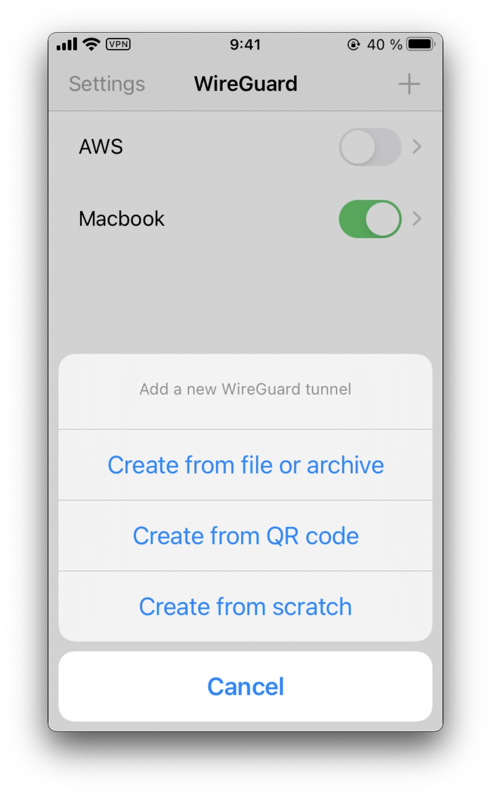

# Non-aware Proxy apps with Wireguard

This post is heavily based on [Nviso's post about intercepting Flutter traffic on iOS](https://blog.nviso.eu/2020/06/12/intercepting-flutter-traffic-on-ios/), but instead of using OpenVPN, we are going to use [Wireguard](https://www.wireguard.com/).

First of all, thanks to my friend @damiapoquet, for his help during the painful troubleshooting.

## Requirements:
+ [Nviso Flutter Test apps](https://github.com/NVISOsecurity/blogposts/tree/master/flutter-testapps)
+ Jailbroken iOS device (I'm using an iPhone SE running iOS 14.3 with checkra1n)
+ Rooted Android device (I'm using a Xiaomi Redmi 9c with Pixel Experience)
+ Computer (Macbook Pro in my case)

## Configuring the server

Initial setup

``` shell
$ brew install wireguard-tools
$ mkdir /usr/local/etc/wireguard/
```

Create the [following files](https://barrowclift.me/post/wireguard-server-on-macos) inside. Replace the interface you have on your Macbook (`en0` in this case), and the internal IP range you want to use (`10.0.10.0/24` in the example):
+ `postup.sh` 
```shell
#!/bin/sh

# 1) Preparing the directory which we'll persist the pf token
#    generated by (2) in. That token can then be used by our
#    postdown.sh script to remove the routing rule in the
#    event Wireguard is shut down on the server.
mkdir -p /usr/local/var/run/wireguard
chmod 700 /usr/local/var/run/wireguard

# 2) Dynamically add the NAT rule, enable the firewall, increase
#    its reference count (-E) and persist the reference token
#    generated by the command into pf_wireguard_token.txt,
#    which postdown.sh will reference when Wireguard is shut
#    down.
echo 'nat on en0 from 10.0.10.0/24 to any -> (en0)' | \
    pfctl -a com.apple/wireguard -Ef - 2>&1 | \
    grep 'Token' | \
    sed 's%Token : \(.*\)%\1%' > /usr/local/var/run/wireguard/pf_wireguard_token.txt   
```

+ `postdown.sh` 
```shell
#!/bin/sh

# 1) Fetch the pf reference token that was generated on
#    Wireguard startup with postup.sh
TOKEN=`cat /usr/local/var/run/wireguard/pf_wireguard_token.txt`

# 2) Remove the reference (and by extension, the pf rule that
#    generated it). Adding and removing rules by references
#    like this will automatically disable the packet filter
#    firewall if there are no other references left, but will
#    leave it up and intact if there are.
ANCHOR='com.apple/wireguard'
pfctl -a $ANCHOR -F all || exit 1
echo "Removed rule with anchor: $ANCHOR"

pfctl -X $TOKEN || exit 1
echo "Removed reference for token: $TOKEN"

rm -f /usr/local/var/run/wireguard/pf_wireguard_token.txt
echo "Deleted token file"
```

Give execution permissions to the scripts:

```sh
$ chmod u+x /usr/local/etc/wireguard/*.sh
```

Generate a key pair for the server and for the device. Store them safely:
```sh
$ umask 077
$ wg genkey | tee privatekey | wg pubkey > publickey
$ wg genkey | tee privatekey_iPhone | wg pubkey > publickey_iPhone
```


And create the `wg0.conf` file. This file will be the server configuration.

```toml
[Interface]
Address = 10.0.10.1/24
PrivateKey = ${PRIVATE_KEY_VALUE}
ListenPort = 51820
PostUp = /usr/sbin/sysctl -w net.inet.ip.forwarding=1
PostUp = /usr/local/etc/wireguard/postup.sh
PostDown = /usr/local/etc/wireguard/postdown.sh
PostDown = /usr/sbin/sysctl -w net.inet.ip.forwarding=0

[Peer]
# Jailbroken iPhone SE
PublicKey = ${Public_key_for_device}
AllowedIPs = 10.0.10.10/32
```

Let's break it down:
+ Interface
    + `Address` will be the server address in the VPN.
    + `PrivateKey` is the private key for the server.
    + `ListenPort` is the listening port, `51820` is the default.
    + `PostUp` will execute these commands when the interface for the VPN is up.
    + `PostDown` will execute these commands when the interface for the VPN is down.

+ Peer
    + `PublicKey` is the device public key generated above, and stored in `publickey_iPhone` if following the commands.
    + `AllowedIPs` IP address which the device with that public key will have.

Time to test it setting the service `up`, and then `down` for our `wg0`:

```shell
$ sudo wg-quick up wg0
[#] wireguard-go utun
[+] Interface for wg0 is utun5
[#] wg setconf utun5 /dev/fd/63
[#] ifconfig utun5 inet 10.0.10.1/24 10.0.10.1 alias
[#] ifconfig utun5 up
[#] route -q -n add -inet 10.0.10.10/32 -interface utun5
[+] Backgrounding route monitor
[#] /usr/sbin/sysctl -w net.inet.ip.forwarding=1
net.inet.ip.forwarding: 0 -> 1
[#] /usr/local/etc/wireguard/postup.sh

$ sudo wg-quick down wg0
[+] Interface for wg0 is utun5
[#] rm -f /var/run/wireguard/utun5.sock
[#] rm -f /var/run/wireguard/wg0.name
[#] /usr/local/etc/wireguard/postdown.sh
[#] /usr/sbin/sysctl -w net.inet.ip.forwarding=0
net.inet.ip.forwarding: 1 -> 0
```

Perfect. Time to move to the client. Install wireguard from the AppStore and then go back to the server.

We are going to generate the configuration file for each device in the server. The following example is `iPhone_wg.conf`:

```toml
[Interface]
PrivateKey = ${Device_Private_Key}
Address = 10.0.10.10/32
DNS = 8.8.8.8, 1.1.1.1

[Peer]
PublicKey = ${Server_Public_key}
AllowedIPs = 0.0.0.0/0
Endpoint = 192.168.89.196:51820
```

+ Interface
    + `PrivateKey`, is the device private key, `privatekey_iPhone` in this post.
    + `Address` is the address assigned also in the server configuration file, `10.0.10.10/32` in this case.
    + `DNS` to be used, in this case, `8.8.8.8` and `1.1.1.1`.
+ Peer
    + `PublicKey` from the server generated before, `publickey` in this article.
    + `AllowedIPs` set to `0.0.0.0/0` to redirect all the traffic through the Wireguard server.
    + `Endpoint` is the computer IP and the port configured.

Now, my recommendation is to use `qrencode` to generate a QR with the configuration:

```shell
$  qrencode --read-from=iPhone_wg.conf --type=UTF8
█████████████████████████████████████████████████████████
█████████████████████████████████████████████████████████
████ ▄▄▄▄▄ █▄█ ▄ ▄ ▄▄▀█▄ ▀█▀▄▄ ▄▀▀ ▄▀▄ ▄ ▀▀▀ █ ▄▄▄▄▄ ████
████ █   █ █ ▄██▀▀█  █  ▀▄█▄▄▄█▀█▀ ▀▄▄▄▀  █ ▄█ █   █ ████
████ █▄▄▄█ █▄█ █▄▀ █▀▄▄▀ ▄ ▄▄▄  █▀▀▄▄ ▀█▄▄▀███ █▄▄▄█ ████
████▄▄▄▄▄▄▄█▄▀ ▀ █ █▄▀▄▀ ▀ █▄█ ▀ █▄▀ ▀ █ █▄▀▄█▄▄▄▄▄▄▄████
████▄ ▄ ██▄▀▄▄▀▄▄█▄█ ▀▄▄▀█▄   ▄▀█ ▀ ▄   ▀▀▀█  █▀▄▄▄█▄████
█████ ▄▀▄▀▄█ █▀▀▀▀▄██▀▄█▄█  ▀ █▀█ ▀   ██    ▀▄▄▄▄▀▀▄█████
███████▄█▀▄▀▄▄ █ █▀▄▀▄█ ▄ ▄▀ ██▄█ ▄ █▀▄▄▄▄▀ ▄█▄▄█▄ ▄ ████
████▀  ██▄▄▄█▄▄▀ ██▀▄█ █   ▄▀▀▄▀▄█▀ ▄▄▄█ ▄  ▀   ▄▄▄▄█████
████▄  ▀█ ▄▀▄  ▀▀█▀▄▄█ ▄▀▄ ▀▄██▄ ▀▀██ █ ▄  ▄█▄▀██▀▀▀ ████
█████  █ █▄█▄▀█▀▀▄▄ █▀▀█▀ ▄█  █▄ ▀ ▄ ▄▄  ▄▀▀▀▀▄▄ ▀█▄▄████
████▀▀██▄▀▄▀ ▀▀▄ █▄▀▄█  ▀  ▄▄ ▀█ ▀ ▀▀█▄▄█▄██▄▀  █ ██▄████
████  █▄ ▄▄▄ ▀ █ ▀█ ▀▄██▄▀ ▄▄▄ ▀█ ▀▄█  █▀▄█▄ ▄▄▄  █▀█████
██████▀  █▄█ ▀  ▀▄  ▀█▀██▀ █▄█ ▄▄▀   ▀▀██ ██ █▄█ ██▀█████
████▄▄  ▄▄▄ ▄▀▀█▀ █▀▄   ▀▀   ▄▄█ █▀▀▄ █▀█ ▀▀ ▄▄  ██  ████
████  ▀  ▄▄▀▄▀▄█▄█▄▄▄▀ ▄▄▀██▀▄▄ █▀█▄▄▀ ▀█ ▄█▄▄█▀█▀ ██████
████▀▄▄▀ ▄▄ ▄▄▄ █▄▀▄▀▀█▄█▄█  █▀▄█▀█ █ ▄▄ █▄▀▀▄▀ ██▀▄ ████
████ ▀▀▄  ▄▄▀ █▄▄▄▀▀ ▄▄ ██▄▄▀▄█ █▀█ ▄▀▄▀ ▀█▀ ▀ ▀██▄▀ ████
████▄ █ ▀▀▄▀▀▀ ▀▄ ▀█▀▄▄  ▀▀▄▀▀ ▀▄▀▄▀ █▄▄  █▀█▀▀▄▄▀  ▄████
██████▀█▀█▄▀▀   ▄▄ ▄▀█ ▄▄▄█ ▀ ▀▀██▄▄▀▀█ ▄█▀█▄ ▄██▄ ▄▄████
█████ ▀▀█▄▄▀▄ █▄▀▄▄ ██▀▄▄ ▄ ▀██▄ ▀ ▀▀ ▀▄▀  █▀█ ▀█  ▄▀████
████▄▄▄███▄█  ▀ █▀ ▄▄   ██ ▄▄▄ █ ▄▀██▄▀ ▄▄▄▀ ▄▄▄ ▄  ▄████
████ ▄▄▄▄▄ ███▄▄ ▀▀▄█  ▄▀  █▄█ ▄▀█▄▀█ █ ▄▀▀▄ █▄█ ▀███████
████ █   █ █▀█▄▀█ ██▄██▄▀▄ ▄▄▄   ▀▀▀███ █ ██▄  ▄ ▀█▀█████
████ █▄▄▄█ █     ██  ▄▄█▄▀ ▄▄ ▄█▀█▄█ ▀  ▄ ██  ▄▄ ▄█▄█████
████▄▄▄▄▄▄▄█▄████▄█▄▄▄█▄█▄██▄▄██▄█▄█▄██▄█▄█▄█████▄▄▄▄████
█████████████████████████████████████████████████████████
█████████████████████████████████████████████████████████
```

Import a new configuration from QR:



Start the server:

```shell
$ sudo wg-quick up wg0
```

And start the switch on the Wireguard application.

> :warning: **Troubleshoting**
Capture the incoming traffic to your Macbook on the principal interface to confirm that the traffic is coming through

```sh
$ sudo tcpdump -i en0 -nn udp and port 51820
```

## Intercept the traffic

After installing the application, it's time to redirect all the incoming traffic to Burp port. This section should be done with macOS `pf`. I'm still digging into this. The closest I've been was using the following redirection rules:

```
rdr on utun3 proto tcp from any to any port 80 -> 127.0.0.1 port 8080
rdr on utun3 proto tcp from any to any port 443 -> 127.0.0.1 port 8080
```

But I did not manage to have it working yet :sad:

Will update this as soon as I have it.

## References
+ https://barrowclift.me/post/wireguard-server-on-macos
+ https://blog.nviso.eu/2020/06/12/intercepting-flutter-traffic-on-ios/
+ https://www.digitalocean.com/community/tutorials/how-to-set-up-wireguard-on-ubuntu-20-04

