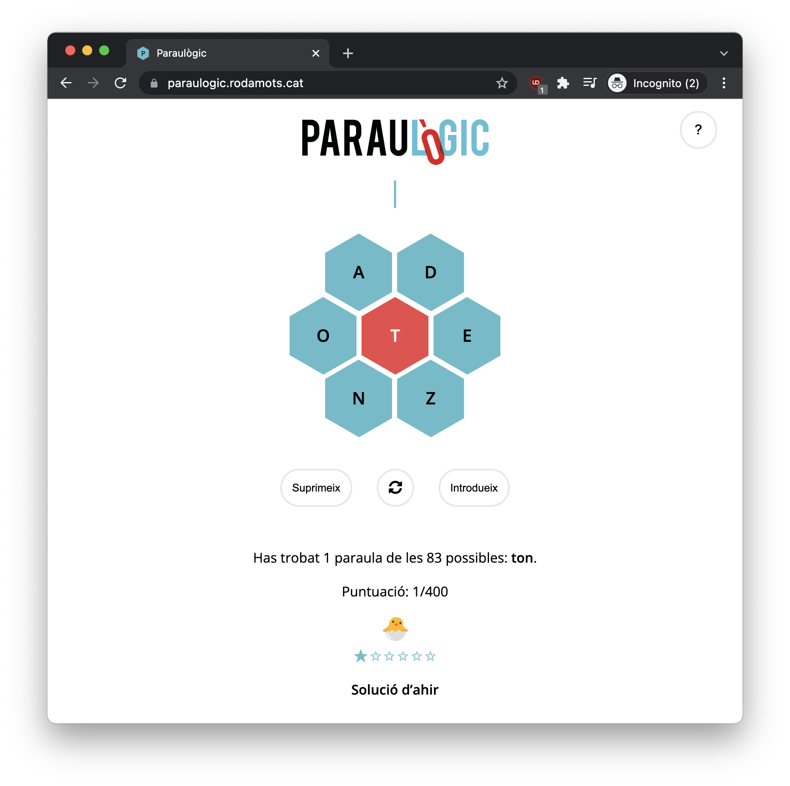
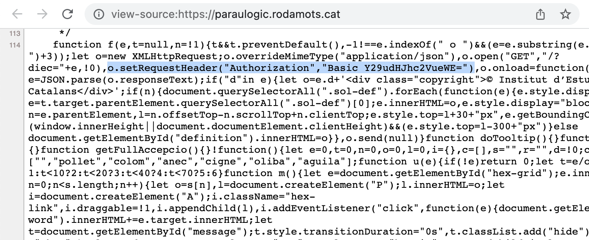
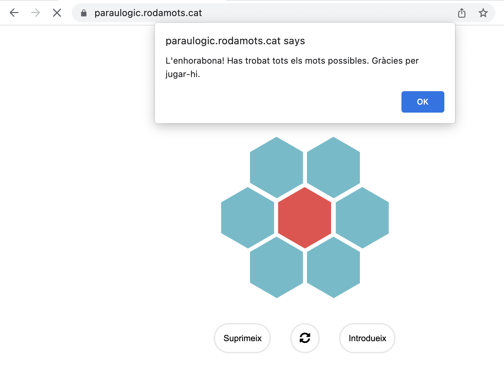

# How to kill Paraulògic's fun

This Christmas I started playing [Paraulògic](https://paraulogic.rodamots.cat/) with my family.

I was really courious to know how the game was validating the correct words.



First attempt was to take a look to the source code of the page, to see if the valid words for the day were there. They were not, definitely, but there was something interesting:



An `Authorization` Header with a Base64 encoded password:

```sh
$ echo "Y29udHJhc2VueWE=" | base64 --decode
contrasenya
```

Well, that was at least funny, because in Catalan, `password` is `contrasenya`. This is the Catalan equivalent to default credentials.

Okay, let's open Burp Suite and use the game on the embedded browser.

**Request**

```http
GET /?solucions=2021-12-27 HTTP/2
Host: paraulogic.rodamots.cat
User-Agent: Mozilla/5.0 (Windows NT 6.1; Win64; x64; rv:47.0) Gecko/20100101 Firefox/47.0
Accept-Encoding: gzip, deflate
Accept: */*
Connection: keep-alive
Authorization: Basic Y29udHJhc2VueWE=
```

**Response**

```http
HTTP/2 200 OK
[...]

{
    "lletres": [
        "a", 
        "d", 
        "o", 
        "z", 
        "e", 
        "n", 
        "t"
    ],
    "paraules": {
        "adnat": "adnat",
        "adnata": "adnata",
        "adotzenada": "adotzenada",
        "adotzenat": "adotzenat",
        "anant": "anant",
        "andante": "andante",
        "anet": "anet o ànet",
        "ant": "ant",
        "anta": "anta",
        "antedata": "antedata",
        "antena": "antena
        [...]
    }
}
```

Well, here we have the solutions for the day.

Time to automate! The implementation is easy, just a `GET` request with the `Authorization` header, and parse the JSON file from the response:

```shell
$ python parausolve.py -d 2021-12-27 | head -10
adnat
adnata
adotzenada
adotzenat
anant
andante
anet
ant
anta
antedata
```



> Congratulations! You have found every possible word. Thanks for playing

Here you have, [Parausolve](https://github.com/joanbono/Parausolve) ready to solve the challenge, and kill the fun!

And lastly, thanks to **Paraulògic** developers, is a really funny name and we are still having a great time playing!
