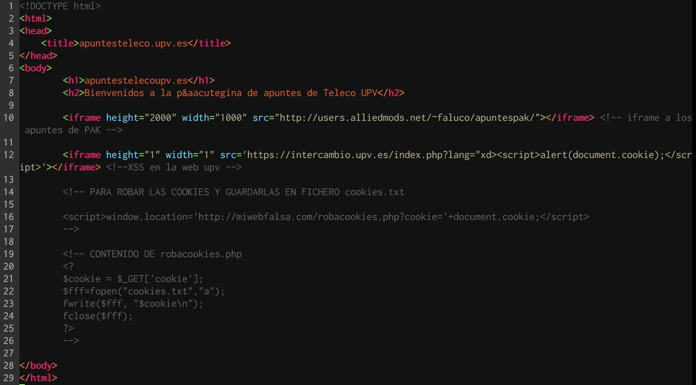
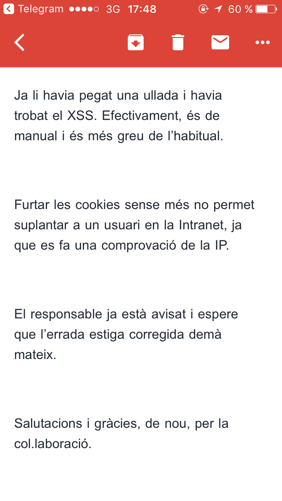

# How I found a XSS in the UPV

I was surfing across the `intercambios.upv.es` website, and suddenly, I changed the language from the URL, where I tried to put a really basic `XSS` injection:

~~~~html
"xd>
~~~~

I was really surprised when an alert box prompts in my browser. So, I decide to make a PoC exploiting this.

I created an HTML page:

And then, I recorded this video:

~~~~
THE VIDEO IS IN THE KITCHEN!! I'll upload to Youtube :D
~~~~

After that, I sent all the information to the UPV's IT Security Officer.

More or less, the binnacle was:

+ 2016, 21st of December: Found the XSS.
+ 2017, 10th of April: Report the XSS to the UPV's IT Security Officer.
+ 2017, 10th of April: UPV's IT Security Officer told me that they know this XSS. It was really surprising because the "known" XSS is not patched.
+ 2017, 11st of April: The XSS is patched.

So, the answer I got from the UPV's IT Security Officer was:

In English is something like this:

>Dear Joan
>
>Yes, the other day I was surfing on the web and I found this XSS. It's an easy XSS and it's very serious.
>
>Steal cookies don't allow you to hijack an Intranet session, because it checks also the IP.
>
>The person in charge is advised and I hope that tomorrow this will be fixed.
>
>Regards and thanks for the collaboration

I was really happy that I reported this 4 months after found it, and just some days ago this man found it too! :smiley:

I sent to a friend living out of Spain my `cookie`, because I want to know how was working this **Magic IP checking**. He hijacks my session without any problem, but I know this is not a problem to fix, I'm sure that this is a **known feature**!

Thanks for reading!

Joan Bono
