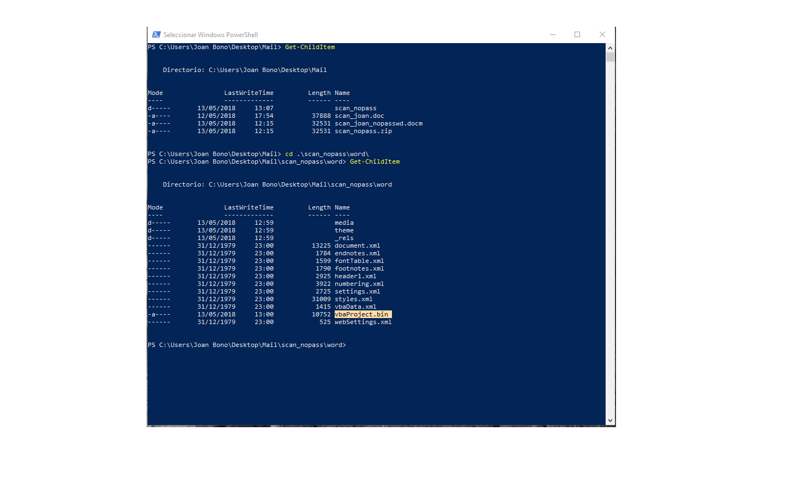

# Analyzing a suspicious email

## The email

I received an email from `Sherwood.Wells@uscourtsgov.com` the other day:

So, after the email, I downloaded the attachment and moved it to a virtual machine.
The document was password protected, and after inserting my personal and unique password `615145` the document asks me to enable content (as expected).

The funniest part came while I tried to see the [macros](https://support.office.com/en-us/article/create-or-run-a-macro-c6b99036-905c-49a6-818a-dfb98b7c3c9c).

Macros were password-protected and with a different one. So, my unique password `615145` was not working here.

***

## Accessing to the macros

Ok, so, first of all, I need to save the document unprotected. That's easy, just save it and delete the password:

Now, I have to change the extension to `.zip` and decompress the file:

Here we have the file we need! Take a look to `vbaProject.bin`.

Time to unlock the macros. I've used [`radare2`](http://radare.org/r/) for that.

The goals here are the following:

1. Find the `DPB` string.
2. Write something different in the third char. In the example I've used `DPx`.
3. Profit! :trollface:

After that, we only need to `zip` everything together, and then change the extension back to `.doc`.

Now, it's time to open our new document. We may have some errors, but it doesn't matter, just say **Yes** to everything.

The point is to save again the document but with unprotected macros. So, we have to go [**Developer Menu**](https://support.office.com/en-us/article/show-the-developer-tab-e1192344-5e56-4d45-931b-e5fd9bea2d45), and under **Tools** `>` **Project Properties**:

Disable the macro protection:

Save the changes in the document and reopen it one more time. Go to the **Developer Menu** and you can find the macros:

***

## The VisualBasic stuff

Not too much to say, the program makes a `GET` request to the URL, and tries to save the content in a `svchost.exe` file to call it after that.

I was not able to download the file since says that the address is not available using `curl` nor getting it by enabling the macros in the document.

***

## Conclusion

It was nice `¯\_(ツ)_/¯`

***

## Appendix

+ [`vbaPatcher.py`](https://github.com/joanbono/vbaPatcher): Python script which uses `r2pipe` to patch the `vbaProject.bin` file.

**IOC**:

+ `scan_joan.doc`
  + `sha512`: `8bd4878213db128a1b9a966ea6a52255b13a313bffe8744836e197645b4d7a928189e8879ff8ec605166ded9b2dc29ced4ae7dc232eca7bbfe3aee15402ca7e8`
  + `md5`: `37980eb2e1ee7be4bbd6b35b90fe2bd7`
  + Malicious URL: `hxxp://185.189.58.180/~filehost/background.png`
