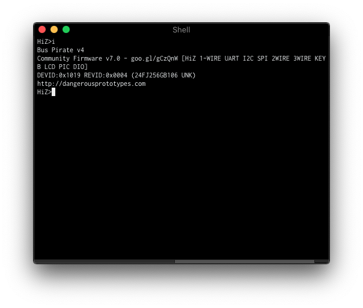

# Upgrading Bus Pirate firmware

Recently I brought my Bus Pirate from Spain to Prague, and I decided to update the firmware.

## Prerequisites:

+ [Pirate Loader code for BusPirate v3](Code/pirate-loader_v3.c).
+ [Pirate Loader code for BusPirate v4](Code/pirate-loader_v4.c).
+ [Bus Pirate v3 firmware (I'll use v6.3)](Code/BPv3-firmware-v6.3-r2151.hex)
+ [Bus Pirate v34firmware (I'll use v7.0)](Code/BPv4_fw7.0_opt0_18092016.hex)
+ One jumper cable 

## Compiling the pirate-loader

I found some pre-compiled binaries on the [Bus_Pirate](https://github.com/DangerousPrototypes/Bus_Pirate/tree/master/BPv4-bootloader/pirate-loader) repository, but it was not working for me because of the `arch` used to create them.

Since we have the source code, we'll compile them:

```sh
# Pirate Loader for BusPirate v3
gcc -O2 -Wall -force_cpusubtype_ALL pirate-loader_v3.c  -DOS=$(uname) -o pirate_loader_v3
```

```sh
# Pirate Loader for BusPirate v4
gcc -O2 -Wall -force_cpusubtype_ALL pirate-loader_v4.c  -DOS=$(uname) -o pirate_loader_v4
```

## Upgrading Bus Pirate v3

First, we'll need to enter in Bootloader mode:

```sh
$ screen /dev/tty.${USB_DEVICE} 115200 8N1

HiZ> $
Are you sure? y
BOOTLOADER
```

Then we'll need to place the jumper between PGD and PGC:


Now we can flash the image:

```py
$ ./pirate_loader_v3 --dev=/dev/tty.usbserial-A900fzzr --hex=BPv3-firmware-v6.3-r2151.hex
+++++++++++++++++++++++++++++++++++++++++++
  Pirate-Loader for BP with Bootloader v4+
  Loader version: 1.0.2  OS: Darwin
+++++++++++++++++++++++++++++++++++++++++++

Parsing HEX file [BPv3-firmware-v6.3-r2151.hex]
Found 21502 words (64506 bytes)
Fixing bootloader/userprogram jumps
Opening serial device /dev/tty.usbserial-A900fzzr...OK
Configuring serial port settings...OK
Sending Hello to the Bootloader...OK

Device ID: PIC24FJ64GA002 [d4]
Bootloader version: 1,02
Erasing page 0, 0000...OK
Writing page 0 row 0, 0000...OK
Writing page 0 row 1, 0080...OK
Writing page 0 row 2, 0100...OK
Writing page 0 row 3, 0180...OK
Writing page 0 row 4, 0200...OK
Writing page 0 row 5, 0280...OK
Writing page 0 row 6, 0300...OK
Writing page 0 row 7, 0380...OK
[...]
Erasing page 41, a400...OK
Writing page 41 row 328, a400...OK
Writing page 41 row 329, a480...OK
Writing page 41 row 330, a500...OK
Writing page 41 row 331, a580...OK
Writing page 41 row 332, a600...OK
Writing page 41 row 333, a680...OK
Writing page 41 row 334, a700...OK
Writing page 41 row 335, a780...OK

Firmware updated successfully :)!
Use screen /dev/tty.usbserial-A900fzzr 115200 to verify
```

After verifying:


## Upgrading Bus Pirate v4

First, we'll need to enter in Bootloader mode:

```sh
$ screen /dev/tty.${USB_DEVICE} 115200 8N1

HiZ> $
Are you sure? y
BOOTLOADER
```

Again, we'll need to place the jumper between PGC and PGD:


Now we can flash the image:
 
```python
$ ./pirate-loader_mac --dev=/dev/tty.usbmodem000000011 --hex=bpv4_fw7.0_opt0_18092016.hex
+++++++++++++++++++++++++++++++++++++++++++
  Pirate-Loader for BP with Bootloader v4+
  Loader version: 1.0.2  OS:
+++++++++++++++++++++++++++++++++++++++++++

Parsing HEX file [bpv4_fw7.0_opt0_18092016.hex]
Found 29880 words (89640 bytes)
Opening serial device /dev/tty.usbmodem000000011...OK
Configuring serial port settings...OK
Sending Hello to the Bootloader...OK

Bootloader version: 4,06
Device ID [f1]:PIC24FJ256GB106
Erasing page 0, 0000...OK
Writing page 0 row 0, 0000...OK
Writing page 0 row 1, 0080...OK
Writing page 0 row 2, 0100...OK
Writing page 0 row 3, 0180...OK
Writing page 0 row 4, 0200...OK
Writing page 0 row 5, 0280...OK
Writing page 0 row 6, 0300...OK
Writing page 0 row 7, 0380...OK
Erasing page 8, 2000...OK
[...]
Writing page 65 row 520, 10400...OK
Writing page 65 row 521, 10480...OK
Writing page 65 row 522, 10500...OK
Writing page 65 row 523, 10580...OK
Writing page 65 row 524, 10600...OK
Writing page 65 row 525, 10680...OK
Writing page 65 row 526, 10700...OK
Writing page 65 row 527, 10780...OK
Erasing page 170, 2a800...OK
Writing page 170 row 1360, 2a800...(SKIPPED by bootloader)...OK
Writing page 170 row 1361, 2a880...(SKIPPED by bootloader)...OK
Writing page 170 row 1362, 2a900...(SKIPPED by bootloader)...OK
Writing page 170 row 1363, 2a980...(SKIPPED by bootloader)...OK
Writing page 170 row 1364, 2aa00...(SKIPPED by bootloader)...OK
Writing page 170 row 1365, 2aa80...(SKIPPED by bootloader)...OK
Writing page 170 row 1366, 2ab00...(SKIPPED by bootloader)...OK
Writing page 170 row 1367, 2ab80...(SKIPPED by bootloader)...OK

Firmware updated successfully :)!
```

And checking:

